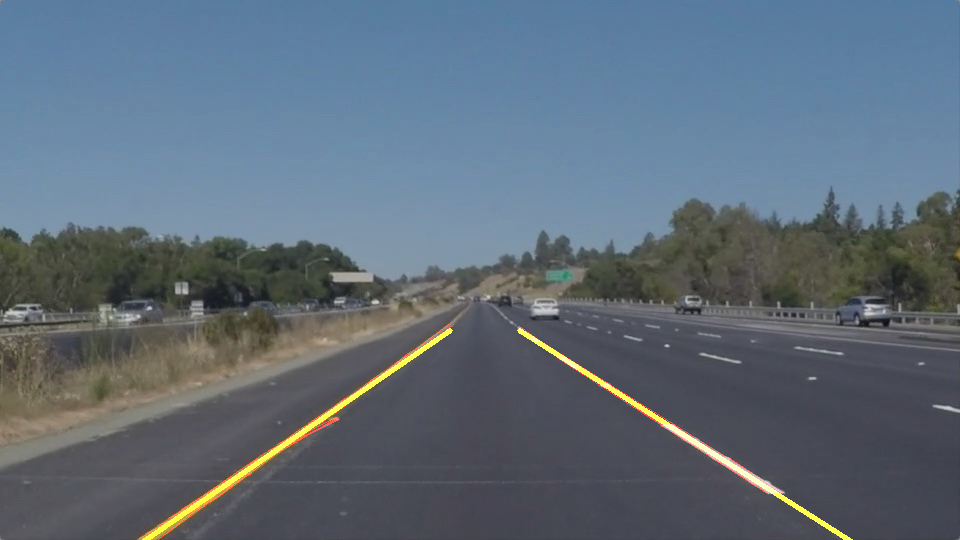

# CarND-LaneLines-P1

This project uses Canny Edge Detection, Hough Transforms, DBSCAN and linear regression to identify and mark lane lines on a road.

A detailed description about the used approach can be found [here](writeup.md).

