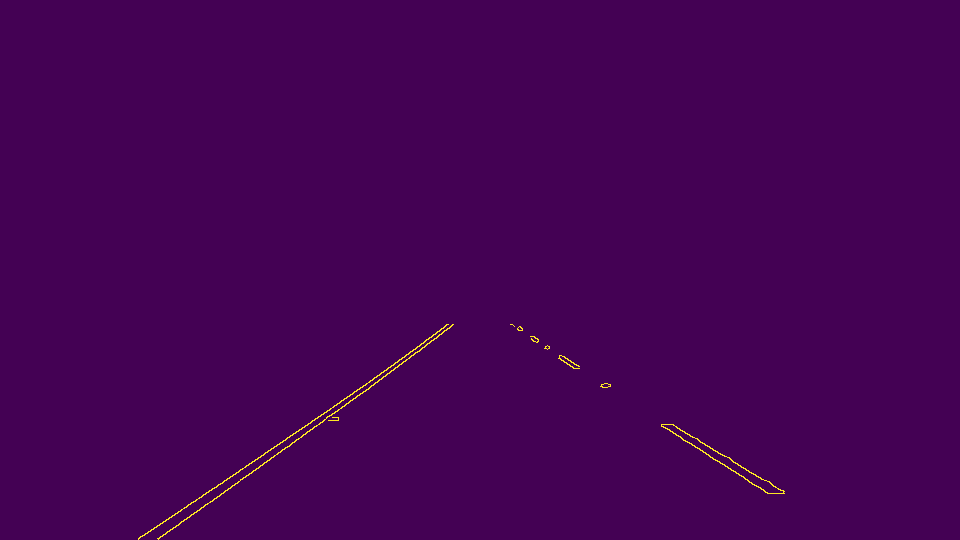
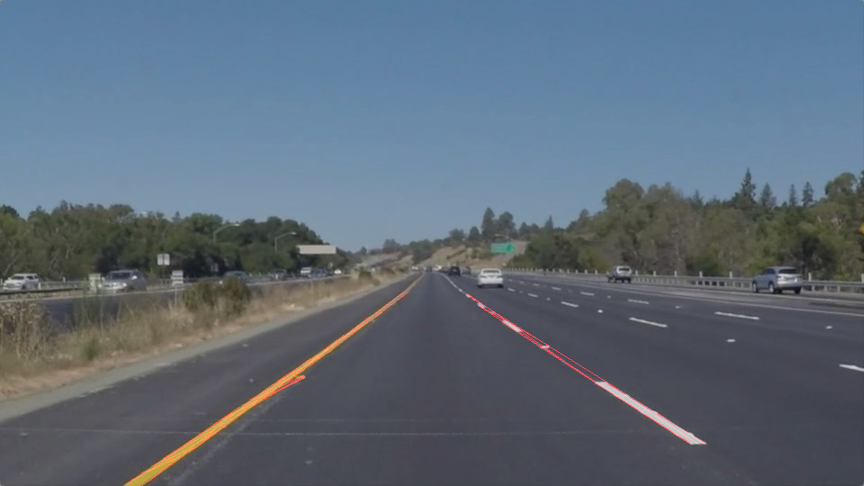

# **Finding Lane Lines on the Road** 

The goals / steps of this project are the following:
* Make a pipeline that finds lane lines on the road
* Reflect on your work in a written report

---

### Reflection

### 1. The image processing pipeline

The image processing pipeline consists of 3 major steps. 

* Edge detection
* Line detection
* Lane detection

#### Edge detection

In order to detect edges the image is first converted into grayscale and filtered by a gaussian blur.
Afterwards edgedes are detected by using the canny detector from OpenCV.

The result of the edge detection looks like this:

#### Line detection

In this step a Hough transformation is applied to the output image of the previous step.
The Hough transformation detects straight lines in the image. Each line is represented as a tuple of points.

The lines are then drawn into the edge image. Because usually many lines are detected in the image (see example above) we need to filter out
only the ones that are relevant. This is done by masking the resulting image with a polygon that is placed on the image
area where lane markings are expected.

The result of the line detection looks like this:

#### Lane detection

Even with the masking filter described above many detected lines remain in the image.
Assuming that lines on a single lane marking will most likely have a similar slope,
I decided to cluster all detected lines in the image by their slope. 
For the clustering I decided to use the DBSCAN algorithm, which I implemented by my own.

After the clustering each line cluster is classified to be either a left or a right lane marking cluster.
This can be easily done by evaluating the average slope of each cluster: 
slope ≤ 0 means left lane marking cluster.
slope > 0 means right lane marking cluster.

Finally linear regression (numpy.polyfit) is used to create one single line per lane marking cluster.
The resulting linear functions are then used to draw the line annotations into the image.

Depending on the clustering parameters and the given image each lane marking class (left and right)
could have more than one cluster. To handle this case only the largest cluster (containing most line detections)
from each cluster class are used for the linear regression. 

The result of the lane detection looks like this:

### 2. Potential shortcomings

One potential shortcoming of the described approach is that only straight lane markings are detected.
This migth be an issue when driving in a curve.

Another shortcoming of the current implementation is that the resulting lane curves are drawn
with fixed y-values on the image. This might not be optimal if only very short lane markings are
detected by the camera.

### 3. Possible improvements

One possible solution to the "straight lines" drawback mentioned above would be to
introduce a multidimensional lane marking model, for example a 3d polynomial.
In order to do this a Hough transform that detects polynomial curves needs to be used.
A possible approach can be found here: http://mida.dima.unige.it/files/hough1.pdf.
The final polyfit could easily be done in a higher dimension because numpy.polyfit already support that.

To improve the drawing of the lane marking curve into the image the maximum y-value
in all detected lines of the related cluster could be used, instead of using fixed numbers.
